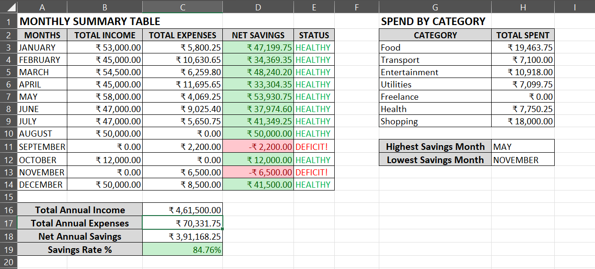
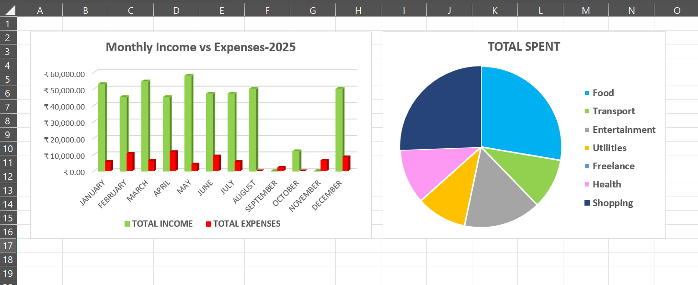
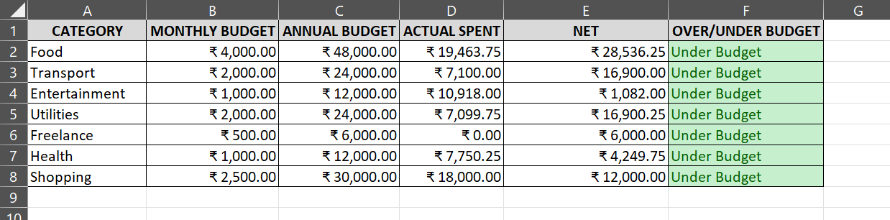
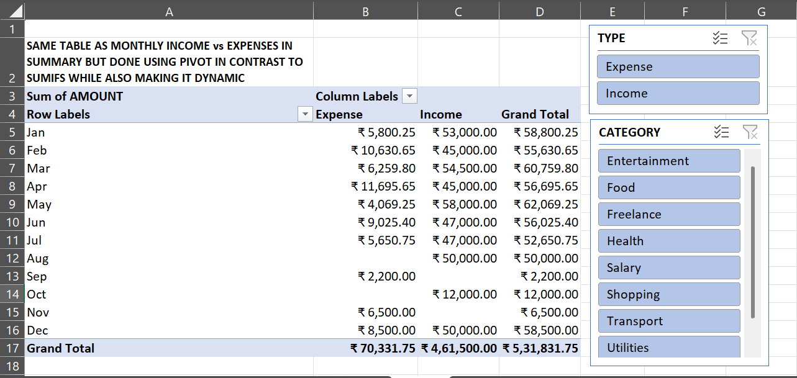

# 📊 Personal Income & Expense Tracker — Excel

A multi-sheet personal finance tracker built in Excel to analyse 12 months of income and expenses. Demonstrates advanced Excel skills including SUMIFS, INDEX-MATCH, nested IF logic, cross-sheet VLOOKUP, pivot tables, and dynamic dashboards.

---

## 📸 Preview

### Summary sheet

*Monthly income vs expenses summary with SUMIFS-driven totals, savings health status flags, and category spend breakdown*

### Charts

*Clustered column chart comparing monthly income vs expenses, and pie chart showing annual spend by category*

### Budget vs actual

*Annual budget tracker comparing planned spend to actual spend per category using cross-sheet VLOOKUP*

### Pivot tables

*Pivot table replicating the monthly income vs expenses summary — built alongside SUMIFS to compare both approaches*

---

## 🗂️ File structure

| Sheet | Description |
|---|---|
| `DATA` | 42 raw transactions across 12 months — Date, Description, Category, Type, Amount |
| `SUMMARY` | Formula-driven monthly summary with status flags, category breakdown, and key stats |
| `CHART` | Monthly income vs expenses bar chart and category spend pie chart |
| `BUDGETS` | Annual budget vs actual spend by category using cross-sheet VLOOKUP |
| `PIVOT1` | Monthly income vs expenses pivot table (same output as SUMIFS — built both to compare approaches) |
| `PIVOT2` | Category spend breakdown pivot table with slicer for dynamic filtering |

---

## 📐 Excel skills demonstrated

### Lookup & reference
- `INDEX-MATCH` — identifies highest and lowest savings month by value lookup; handles ties using `TEXTJOIN + IF` array formula (`Ctrl + Shift + Enter`)
- `VLOOKUP` — pulls budget figures from the `BUDGETS` sheet using cross-sheet reference (`Budgets!$A$2:$B$7`)

### Conditional aggregation
- `SUMIFS` — aggregates income and expenses by month and type simultaneously using `DATE()` boundary conditions
- `COUNTIFS` / `AVERAGEIFS` — transaction count and average spend per category

### Logic
- Nested `IF` — 4-level savings health flag per month: Deficit → Low savings → Moderate → Healthy, calculated against savings rate thresholds

### Error handling
- `IFERROR` — wraps VLOOKUP calls to return "Not found" cleanly for missing categories

### Data tools
- Pivot tables — two pivot tables replicating SUMIFS outputs dynamically; demonstrates both formula and pivot approaches to the same problem
- Slicers — dynamic filtering by Type and Category applied to pivot tables
- Data validation — dropdown menus on `Category` and `Type` columns to enforce consistent data entry

### Formatting
- Conditional formatting with colour scales — green/white/red on the Net Savings column
- Conditional formatting with rules — red flag when savings rate drops below 0%
- Number formatting — comma separators, 2 decimal places, percentage display

---

## 📊 Key insights from the data

| Metric | Value |
|---|---|
| Total annual income | ₹4,61,500 |
| Total annual expenses | ₹70,331.75 |
| Net annual savings | ₹3,91,168.25 |
| Savings rate | ~84.8% |
| Highest savings month | May (₹53,930) |
| Lowest savings month | November (–₹6,500, deficit) |
| Deficit months | September, November |
| Largest expense category | Food (₹19,463) |

---

## 🛠️ Tools used

- Microsoft Excel 2021

---

## 💡 Notes

- Data used in this project is sample/dummy data created for practice purposes
- The same monthly breakdown is built two ways — using `SUMIFS` formulas and using pivot tables — to demonstrate both approaches and understand the trade-offs
- Pivot tables update dynamically when new rows are added to the `DATA` sheet (right-click → Refresh)

---

*Built as Week 1 of a 17-week financial analyst learning roadmap.*
